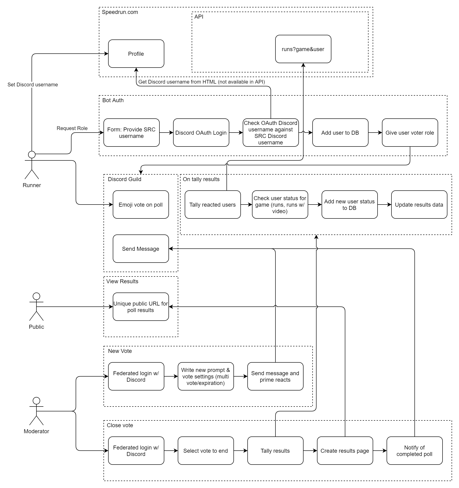

# speedrun-vote

Orchestrate community votes using pseudo-authentication with speedrun.com via Discord.

## Prototype Design

The initial prototype scope includes:

- Pseudo-authentication with speedrun.com via Discord
- Discord bot that manages roles (runner, moderator)
- Voting using Discord reaction emojis
- Web page for initiating votes
- Results page, with filters by runners proof levels

The prototype excludes:

- Multi-game setup
- Requests to add bot to Discord server

